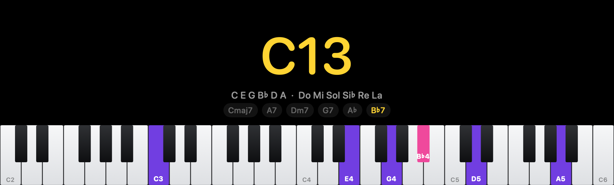

# Chordware

A piano keyboard for your Mac that names what you play.



Play your MIDI keyboard and Chordware shows the chord, lights up the keys you
are holding, and keeps the last few chords along the bottom. Click one to put it
back on the keyboard.

Free, open source, and nothing leaves your Mac.

## What it shows you

- **The chord**, in big yellow letters.
- **Its notes twice** — in letters and in Do Re Mi — so you can learn one
  system from the other.
- **Every key you are holding**, named with its octave: `D4`, `B♭3`.
- **White keys in violet, black keys in pink**, so a sharp is never mistaken for
  the key beside it.
- **The last eight chords** along the foot. Click one to see it again.

It also records everything you play from the moment it starts, so an idea you
stumble into is never lost. Save it as a MIDI file whenever you like.

## Install

You need macOS 14 or later and Apple's Command Line Tools
(`xcode-select --install` if you have not got them).

```bash
git clone https://github.com/phugadev/chordware.git
cd chordware
make run
```

That builds it, puts it in `/Applications` and opens it. Plug in a keyboard and
play.

## Using it

Chordware has no Dock icon — it lives in the menu bar. These shortcuts work from
anywhere, including when the menu bar is too full to show it:

| | |
|---|---|
| `Control-Option-Command-C` | show or hide the window |
| `Control-Option-Command-T` | keep it in front of everything else |
| `Control-Option-Command-K` | panic: let go of every note |

Closed the window and lost it? Open Chordware again from Spotlight and it comes
back.

The menu bar item has the rest: which keyboard to listen to, how many octaves to
draw, saving what you played, and clearing the history.

### Playing through to a DAW

Chordware publishes a MIDI port called `Chordware`. Turn on **Send MIDI to DAW**
and your keyboard is forwarded through it.

Only do that if you also tell your DAW to stop listening to the keyboard
directly. Otherwise every note arrives twice and it sounds broken.

## The command line

The same engine without the window:

```bash
chordware analyze C4 E4 G4 Bb4      # name a voicing
chordware analyze "Dm7 G7 Cmaj7"    # the key, the roman numerals, the cadences
chordware chord C7#9                # notes, intervals, scales that fit
chordware scales altered --root F#
chordware devices                   # what is plugged in
```

It ships inside the app, at `Chordware.app/Contents/Helpers/chordware`.

## Building it

```bash
make run     # build, install to /Applications, launch
make test    # run the tests
make dmg     # package it up
```

No Xcode project and no third-party code — just Swift and what macOS already
has. The music theory lives in its own layer with no system frameworks in it,
which is why the tests run without a keyboard, a window or a sound card.

## Licence

MIT. See [LICENSE](LICENSE).
